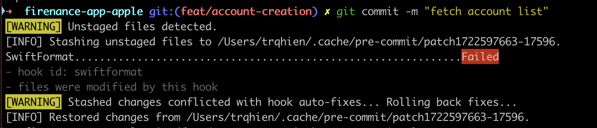

# mouka

Official iOS, macOS app for mouka

* [Architecture](#architecture)
* [Script](#learn-more)
* [Code generation](#code-generation)

## Architecture

[WIP]

## Scripts

[WIP]

## Code generation

### Assets

We are using [SwiftGen](https://github.com/SwiftGen/SwiftGen)
configuration file [.swiftgen.yml](./swiftgen.yml)
templates:
- [colors](./FireModules/Sources/Shared/CoreUI/CodeGen/Templates/ColorTemplate.stencil)
- [fonts](./FireModules/Sources/Shared/CoreUI/CodeGen/Templates/FontTemplate.stencil)

To generate assets files, simply run `swiftgen` from the root directory.

## SwiftFormat

Install **pre-commit**, run `pre-commit install`

If you run into issue while commiting you code, like the one below. Just clear the catch by running `pre-commit clean` and `pre-commit install` again

